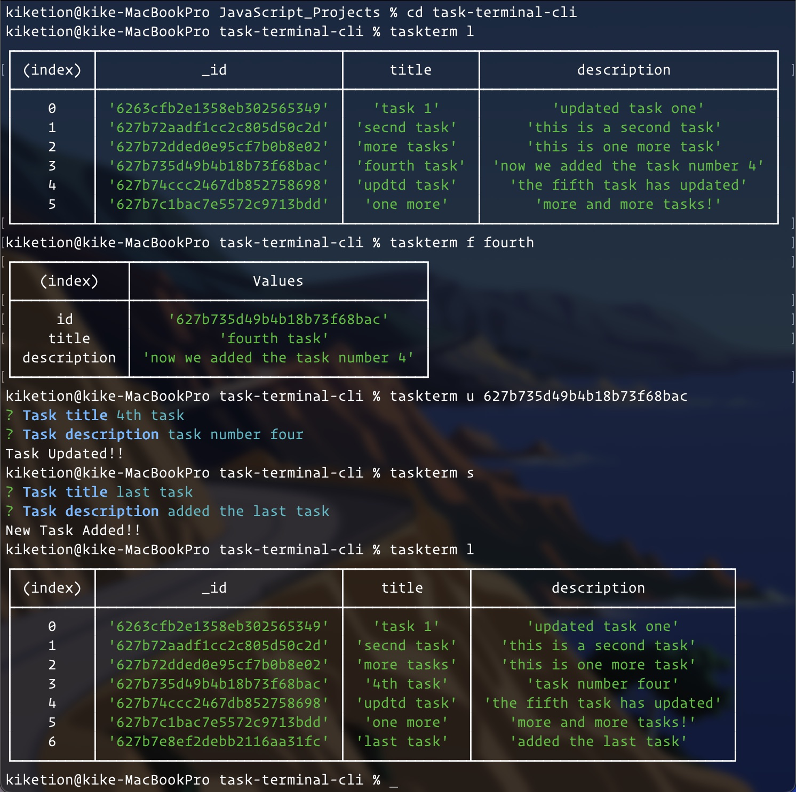

# TASKTERM

This is a Command Line Interface (CLI) application that allows you to create, edit, find and delete tasks in a database stored in MongoDB Atlas.

## Instructions:

This application contains a MongoDB Atlas link address hided in a .env file for security purposes. To test the app you will have to create a new database and add an environment variable with the name MONGODB_URI which keeps the address of this new database.

after you download the application you will have to run it with the command:

- npm link

this will allowyou to use the application using the command: 'taskterm'

**Commands:**

- taskterm l: list all tasks
- taskterm s: add a new task
- taskterm u <id>: update a task
- taskterm d <id>: delete a task
- taskterm f <some word>: find a task with thast word

  
